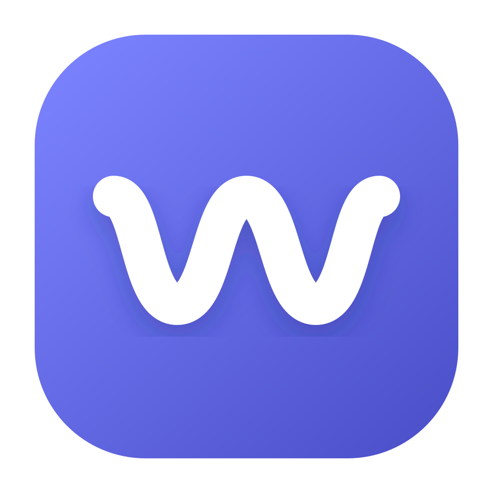
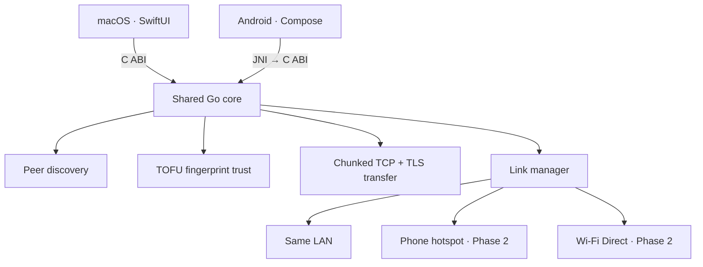

<div align="center">
  

  # Wigly Woo

  **Fast, nearby file transfer with one shared Go core and thin native shells.**

  No accounts. No cloud. No shared Wi-Fi required.

  [Portfolio](https://hetsaraiya.com/projects/wigly-woo) ·
  [Releases](https://github.com/hetsaraiya/wigly-woo/releases)
</div>

## Overview

Wigly Woo is a LocalSend-style file transfer app for macOS and Android. Its
native SwiftUI and Compose shells handle interface and platform-specific radio
controls, while discovery, trust, encryption, and transfer logic live once in
Go.



The shells only draw UI and pull OS-specific radio levers; **all protocol logic
lives once in Go**. The transfer layer runs identically regardless of how the
two devices reached a shared subnet — that decoupling is the whole design.

## Repository layout

| Path | What | Builds here? |
|------|------|--------------|
| `core/` | The Go engine + CLI + C-ABI (`ffi/`) | **Yes** — `go build ./...` |
| `macos/` | SwiftUI app linking the core's static `.a` | **Yes** — `swift build` |
| `android/` | Compose app, JNI shim → core's `.so` | Needs Android Studio + NDK |

## Status

**Phase 1:** same-LAN discovery (UDP multicast beacon) +
TLS file transfer with trust-on-first-use fingerprints. Verified end-to-end via
the CLI (`core/cmd/woo`). Phone-hotspot and Wi-Fi Direct are stubbed behind the
link-strategy interface (the "radio levers" each shell fulfills) — that's Phase 2.

**Remote companion test mode:** Android notifications, notification replies and
dismissal, text clipboard sync, and Mac-to-Android keyboard input can also use
an encrypted Supabase Realtime channel. This path works across unrelated Wi-Fi
and mobile networks. It deliberately has no user accounts yet; see
[`supabase/README.md`](supabase/README.md) for setup and security boundaries.

## Quick start — the engine (works today)

```bash
cd core
go build -o /tmp/woo ./cmd/woo

# terminal 1
/tmp/woo recv -dir ./incoming

# terminal 2
/tmp/woo send -to <receiver-name> ./somefile.bin
```

`woo list` shows nearby peers. Both ends must be on the same LAN for Phase 1.

## Build the macOS app

```bash
cd macos
./build-core.sh      # cross-builds the Go core into Vendor/woocore/libwoocore.a
swift build          # or: swift run WiglyWoo
```

To produce a launchable, ad-hoc signed application bundle:

```bash
cd macos
chmod +x package-app.sh
./package-app.sh
open dist/WiglyWoo.app
```

Output: `macos/dist/WiglyWoo.app`

Tagged releases are also available through the project Homebrew tap:

```bash
brew install --cask hetsaraiya/tap/wigly-woo
```

The free release build is ad-hoc signed rather than Apple-notarized. On first
launch, macOS may require **System Settings → Privacy & Security → Open Anyway**.

(A bundled `.app` with a code-signed UI is best produced by opening the package
in Xcode; `swift build` is enough to compile and link against the core.)

## Build the Android app

### Option A — Docker (no local Android SDK / NDK / Gradle)

Only Docker is required. Start Docker Desktop, then:

```bash
docker/build-android.sh
# -> android/app/build/outputs/apk/debug/app-debug.apk
adb install -r android/app/build/outputs/apk/debug/app-debug.apk
```

The container has Go + the Android SDK/NDK + Gradle; it cross-compiles the Go
core to a `.so` per ABI and assembles the APK onto your host. It is pinned to
`linux/amd64` because the NDK host toolchain is x86_64-only — on Apple Silicon
it runs under emulation (slower first build, but correct).

### Option B — local toolchain

```bash
cd android
export ANDROID_NDK_HOME=$HOME/Library/Android/sdk/ndk/<version>
./build-core.sh      # cross-compiles libwoocore.so for each ABI into jniLibs/
# then open ./android in Android Studio, or: ./gradlew :app:assembleDebug
```

> Note: macOS/iOS cannot be containerized — Apple's toolchain only runs on
> macOS. The Mac app builds locally with the Swift command-line tools (no full
> Xcode needed), so there's nothing extra to install there either.

Versioned, signed APKs are attached to each tagged
[GitHub release](https://github.com/hetsaraiya/wigly-woo/releases).

## The FFI boundary

One C ABI, two shells. See [`core/ffi/woocore.h`](core/ffi/woocore.h) for the
full contract. In short:

- **Downcalls** (shell → core): `woo_start`, `woo_send_file`, `woo_trust`, `woo_peers_json`
- **Events** (core → shell): one `woo_event_cb` delivering JSON envelopes
  (`peer_found`, `trust_request`, `progress`, `done`, `error`)
- **Link levers** (Phase 2): the radio actions only the shell can do, behind
  `link.Levers` in the core

macOS links the static archive directly via a module map; Android loads the
`.so` and reaches it through `woo_jni.c`.

## Security model

- File transfers use TLS over a direct TCP connection.
- Trust-on-first-use fingerprints let users approve a device before transfer.
- Protocol and trust decisions live in the shared core on both platforms.
- The optional remote companion encrypts payloads before they reach Supabase;
  review [`supabase/README.md`](./supabase/README.md) before enabling it.

## Development

Run the Go core tests:

```bash
cd core
go test ./...
```

Build both native shells after changing the C ABI to catch integration drift.
Keep `core/ffi/woocore.h`, the Swift bindings, and the JNI shim synchronized.

## License

Wigly Woo is available under the [MIT License](./LICENSE).
